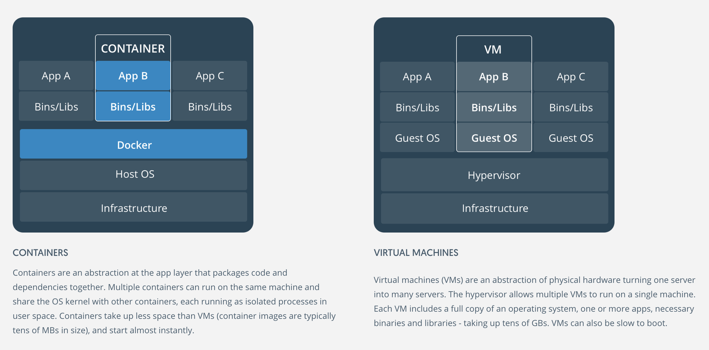

# Container
From Docker's explanation, [original web](https://www.docker.com/what-container#/virtual_machines)

A container image is a lightweight, stand-alone, executable package of a piece of software that includes everything needed to run it: code, runtime, system tools, system libraries, settings. Available for both Linux and Windows based apps, containerized software will always run the same, regardless of the environment. Containers isolate software from its surroundings, for example differences between development and staging environments and help reduce conflicts between teams running different software on the same infrastructure.
## Container is basically like a virtual machine. Instead of virtualizing the hardware, it virtualizes the operating system

Even simpler Container explaination ([YouTube](https://www.youtube.com/watch?v=IEGPzmxyIpo)) 
Container in 1 Minute ([YouTube](https://www.youtube.com/watch?v=n-JwAM6XF88)) 
Container in kubernetes ([Kubernetes](https://kubernetes.io/docs/concepts/overview/what-is-kubernetes/#why-containers))
